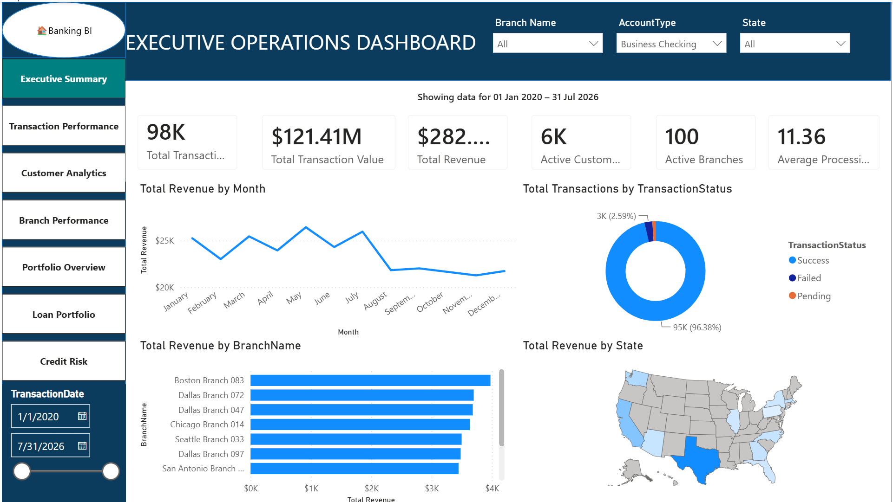
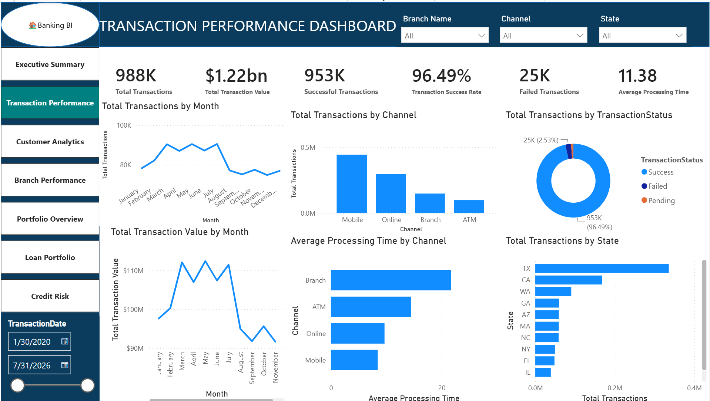
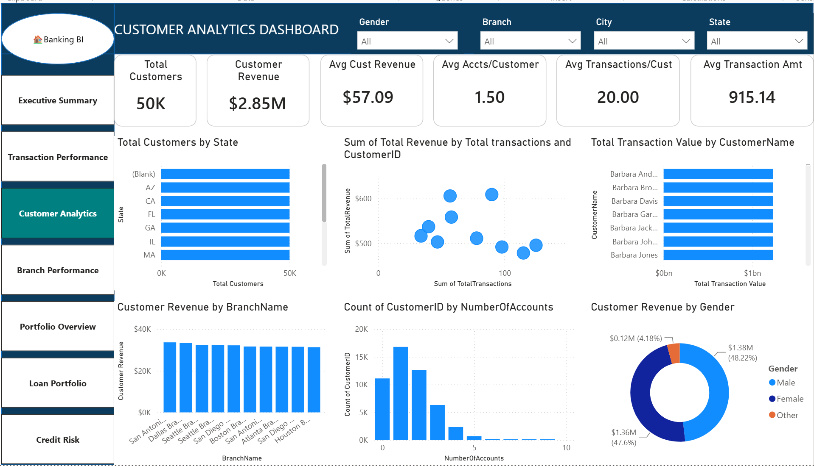
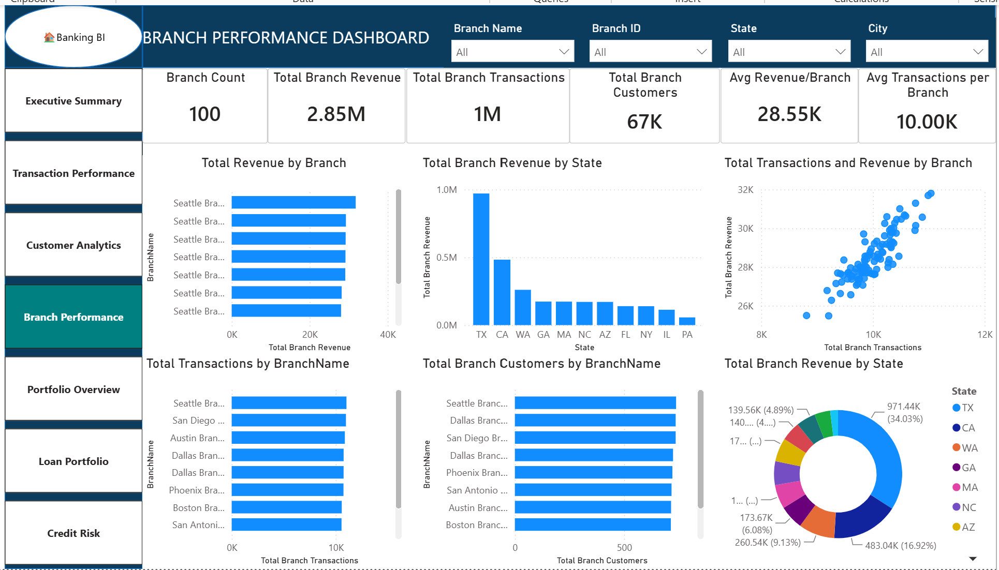
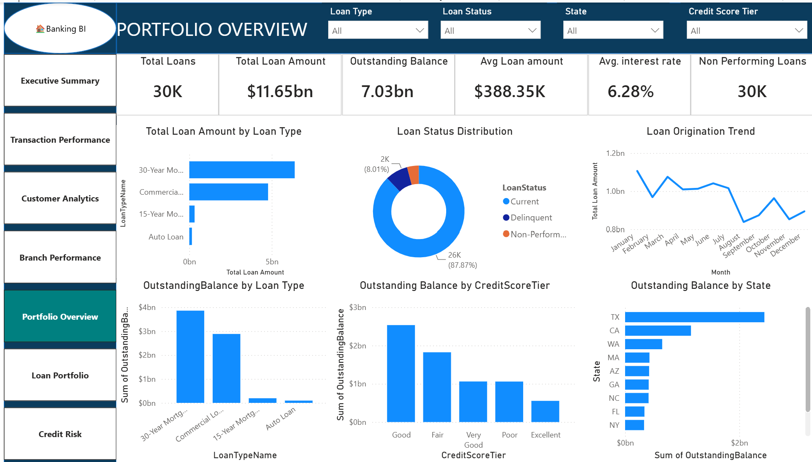
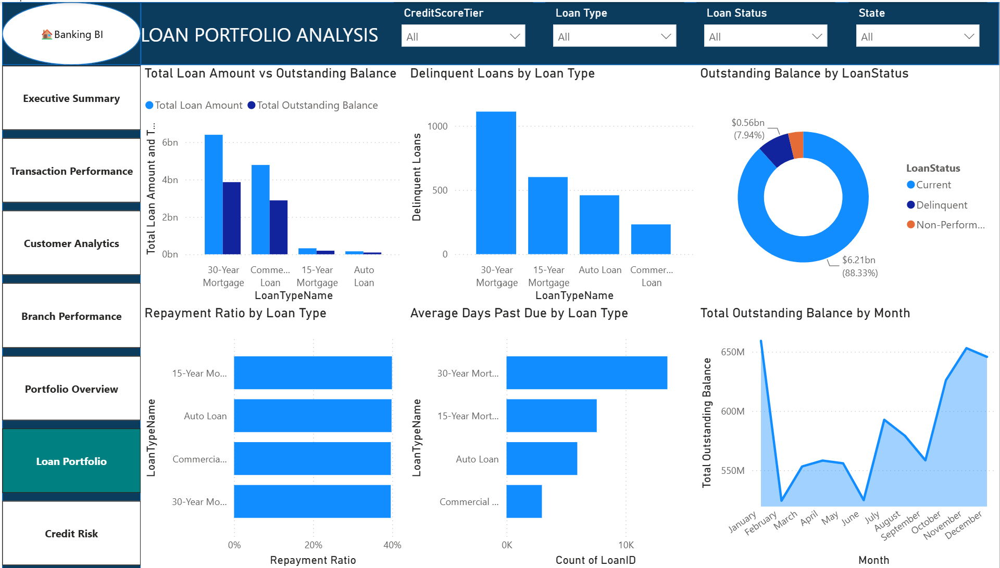
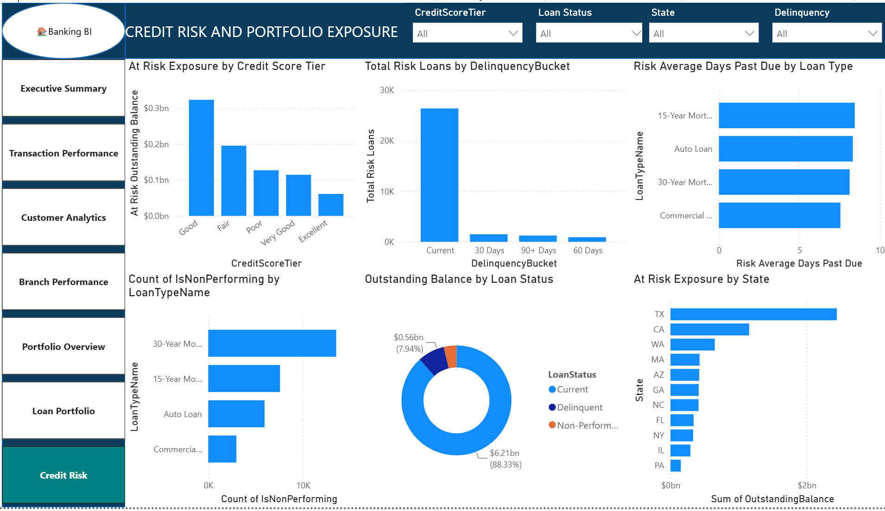
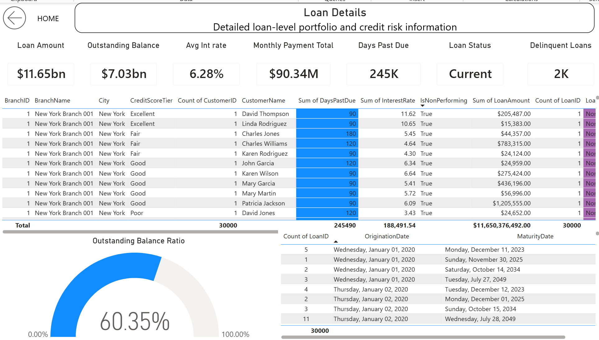

# Banking Analytics — SQL Server, Python & Power BI

## Project Overview

This project demonstrates an end-to-end banking analytics solution built using Python, SQL Server, and Power BI.

A synthetic banking data warehouse was created to support transaction analytics, customer analytics, branch performance, loan portfolio analysis, and credit-risk reporting.

The project covers the complete analytics workflow:

**Python Data Generation → SQL Server Data Warehouse → Data Validation & Optimization → Power BI Semantic Model → DAX → Interactive Dashboards**

The final solution contains approximately **1 million banking transactions, 50,000 customers, 75,000 accounts, 100 branches, and 30,000 loans**.

---

## Business Objectives

The solution was designed to answer banking and financial analytics questions such as:

- How much transaction volume and revenue is being generated?
- Which branches are performing best?
- How are customers interacting with banking products?
- What is the composition of the loan portfolio?
- What percentage of loans are delinquent or non-performing?
- Where is credit-risk exposure concentrated?
- How does risk vary by loan type, credit-score tier, branch, and state?

---

## Technology Stack

| Technology | Usage |
|---|---|
| Python | Synthetic banking data generation and validation |
| Pandas | Dataset creation and transformation |
| NumPy | Data generation and numerical operations |
| Jupyter Notebook | Python development workflow |
| SQL Server | Banking data warehouse |
| T-SQL | Tables, views, stored procedures, functions, indexes and validation |
| Power BI Desktop | Data modeling and dashboard development |
| Power Query | Data preparation |
| DAX | KPI and analytical measures |
| Git | Source control |
| Git LFS | Power BI PBIX versioning |
| GitHub | Portfolio and project documentation |

---

## Solution Architecture

```text
Python / Jupyter Notebooks
          |
          v
Synthetic CSV Data
          |
          v
SQL Server — BankingDW
          |
          +-----------------------------+
          |                             |
          v                             v
   Dimension Tables                Fact Tables
                                     
 DimBranch                       FactTransactions
 DimCustomer                     FactLoans
 DimAccount
 DimLoanType
 DimCreditScoreTier
 DimDate
          |
          v
SQL Analytics Layer
          |
          +-- Views
          +-- Stored Procedures
          +-- Functions
          +-- ETL Logging
          +-- Indexes
          +-- Data Quality Validation
          |
          v
Power BI Semantic Model
          |
          v
DAX Measures
          |
          v
Interactive Banking Analytics Dashboard
```

More information is available in [Architecture Documentation](Documentation/Architecture/architecture.md).

---

## Data Warehouse

### Dimension Tables

The warehouse contains six primary dimensions:

- `DimBranch`
- `DimCustomer`
- `DimAccount`
- `DimLoanType`
- `DimCreditScoreTier`
- `DimDate`

### Fact Tables

#### FactTransactions

Contains **1,000,000 transaction records** supporting analysis of:

- transaction volume
- transaction value
- revenue
- processing time
- transaction status
- transaction channel
- customers
- accounts
- branches

#### FactLoans

Contains **30,000 loan records** supporting analysis of:

- loan amount
- outstanding balance
- interest rate
- loan status
- days past due
- non-performing loans
- credit-score tiers
- loan types
- origination dates
- maturity dates

---

## Dataset Scale

| Dataset | Records |
|---|---:|
| Branches | 100 |
| Customers | 50,000 |
| Accounts | 75,000 |
| Transactions | 1,000,000 |
| Loans | 30,000 |
| Date Dimension | 16,802 |

The date dimension covers:

**January 1, 2020 through December 31, 2065**

---

## Synthetic Data Generation

Python and Jupyter Notebook were used to generate the synthetic banking datasets.

The generation workflow is available under:

`Python/Data_Generation/`

Notebooks:

1. `01_Generate_Customers.ipynb`
2. `02_Generate_Branches_Accounts.ipynb`
3. `03_Generate_Transactions.ipynb`
4. `04_Generate_Loans.ipynb`

Large generated CSV files are intentionally excluded from the repository. The notebooks provide the reproducible data-generation workflow.

---

## SQL Development

The SQL implementation includes database creation, warehouse tables, ETL support, reporting objects, performance optimization, and data-quality validation.

### Reporting Views

- `vw_BranchPerformance`
- `vw_CreditRisk`
- `vw_CustomerAnalytics`
- `vw_ETLStatus`
- `vw_ExecutiveOperations`
- `vw_LoanPortfolio`

### Stored Procedures

- `usp_BranchPerformance`
- `usp_CreditRiskSummary`
- `usp_CustomerAnalytics`
- `usp_ExecutiveDashboard`
- `usp_LoanPortfolioSummary`
- `usp_LogETLExecution`
- `usp_WarehouseStatistics`

### SQL Functions

Reusable functions were created for:

- branch revenue
- customer lifetime revenue
- delinquency rate
- non-performing loan ratio
- total loan exposure

### Indexing

Nonclustered indexes were added to high-use fact-table columns, including:

- transaction date
- customer
- account
- branch
- loan origination date
- loan maturity date
- loan type
- loan status
- credit-score tier

These indexes support filtering, joins, and analytical query performance.

---

## Data Quality Validation

The warehouse was validated for:

- expected table row counts
- null values
- foreign-key integrity
- customer/account consistency
- invalid transaction amounts
- loan balance validity
- valid loan-status values
- non-performing loan flags
- origination-date integrity
- maturity-date integrity

Key validation results included:

- **1,000,000 transaction records**
- **30,000 loan records**
- **50,000 customers**
- **0 invalid loan origination dates**
- **0 invalid loan maturity dates**
- **0 customer/account mismatches**

The consolidated validation script is available at:

`SQL/09_Validation/01_Data_Quality_Validation.sql`

---

# Power BI Dashboard

The Power BI solution contains seven main analytical pages plus a Loan Details drill-through page.

## 1. Executive Summary



Provides management-level visibility into transaction activity, revenue, customers, and overall banking performance.

---

## 2. Transaction Performance



Analyzes transaction volume, transaction value, processing performance, status, channel, and revenue trends.

---

## 3. Customer Analytics



Provides customer-level analysis including customer activity, account behavior, transaction activity, and revenue contribution.

---

## 4. Branch Performance



Compares branches using revenue, transaction volume, customer activity, and geographic performance.

---

## 5. Portfolio Overview



Provides an executive overview of the banking loan portfolio, including loan exposure, outstanding balances, delinquency, and non-performing loans.

---

## 6. Loan Portfolio Analysis



Analyzes portfolio composition, loan types, repayment behavior, outstanding balances, and delinquency.

---

## 7. Credit Risk



Analyzes credit-risk exposure by loan status, credit-score tier, loan type, delinquency bucket, and geography.

---

## 8. Loan Details — Drill-through



Provides detailed loan-level investigation through Power BI drill-through functionality.

---

## Power BI Features

The report includes:

- DAX KPI measures
- synchronized State slicers
- cross-filtering
- drill-down
- Loan Details drill-through
- report-page tooltips
- bookmarks
- interactive filter controls
- page navigation
- conditional formatting
- responsive mobile layouts
- standardized report-wide visual design

---

## Performance Optimization

Power BI Performance Analyzer was used to evaluate key report pages.

During testing:

- Credit Risk visuals generally completed in approximately **167–261 ms**
- the slowest observed Executive Summary visual completed in approximately **699 ms**
- State-filter interaction testing remained responsive
- no tested visuals required multiple seconds to render

SQL Server fact tables were also indexed to support analytical filtering and joins.

---

## Quality Assurance

The final report was tested for:

- KPI accuracy
- filter behavior
- synchronized slicers
- chart interactions
- drill-through
- tooltips
- bookmarks
- navigation
- conditional formatting
- mobile layouts
- model refresh
- report responsiveness

See the [QA Summary](Documentation/QA/qa_summary.md) for additional details.

---

## Repository Structure

```text
banking-analytics-sql-powerbi/
|
+-- SQL/
|   +-- 01_Database_Setup/
|   +-- 02_Dimension_Tables/
|   +-- 03_Fact_Tables/
|   +-- 04_ETL/
|   +-- 05_Views/
|   +-- 06_Stored_Procedures/
|   +-- 07_Functions/
|   +-- 08_Indexes/
|   +-- 09_Validation/
|
+-- Python/
|   +-- Data_Generation/
|
+-- PowerBI/
|   +-- BankingBIProject.pbix
|   +-- Screenshots/
|
+-- Documentation/
|   +-- Architecture/
|   +-- Data_Dictionary/
|   +-- QA/
|
+-- README.md
+-- .gitignore
+-- .gitattributes
```

---

## How to Explore the Project

### SQL

Start with:

`SQL/01_Database_Setup/`

Then review the dimensions, fact tables, reporting views, stored procedures, functions, indexes, and validation scripts in numerical folder order.

### Python

Review:

`Python/Data_Generation/`

to see how the synthetic banking datasets were generated.

### Power BI

The final Power BI Desktop report is:

`PowerBI/BankingBIProject.pbix

Git LFS is used to manage the PBIX file.

Dashboard screenshots are available under:

`PowerBI/Screenshots/`

---

## Project Highlights

This project demonstrates practical experience with:

- end-to-end BI solution development
- dimensional data modeling
- large transaction datasets
- Python-based synthetic data generation
- SQL Server development
- T-SQL reporting
- stored procedures and functions
- SQL performance optimization
- data-quality validation
- Power BI semantic modeling
- DAX
- financial KPI development
- loan portfolio analytics
- credit-risk analytics
- drill-through and report interactivity
- dashboard performance testing
- Git and GitHub source control

---

## Notes

All banking data used in this project is **synthetic and created for portfolio and analytical-development purposes**. No real customer or financial information is included.

Power BI Service publication is not included in this implementation; the report was developed and fully tested in Power BI Desktop.